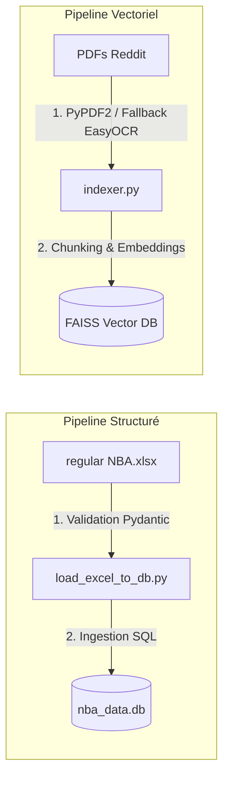

# Rapport de Mise en Place et d'Évaluation du Système RAG Hybride

Ce rapport présente l'analyse technique de la mise en place du système **NBA Analyst AI** (RAG Hybride combinant recherche sémantique vectorielle et base de données SQL) et l'évaluation scientifique de ses performances à l'aide du framework Ragas.

---

## Métadonnées du Projet
* **Nom du Système :** NBA Analyst AI
* **Version :** 1.1.0 (Hybride SQL)
* **Date du Rapport :** 24 juin 2026
* **Moteur d'Orchestration :** Pydantic AI
* **LLM Principal :** Mistral AI (`mistral-small-latest`)
* **Modèle d'Embeddings :** Mistral AI (`mistral-embed`)

---

## 1. Contexte et Objectifs

Les architectures classiques de RAG (Retrieval-Augmented Generation) excellent dans l'extraction de contextes qualitatifs au sein de documents textuels non structurés. Cependant, elles présentent deux limitations majeures :
1. **Faiblesse sur les données chiffrées :** Les modèles d'embeddings ne capturent pas les relations mathématiques complexes nécessaires pour répondre à des requêtes d'agrégation statistique (ex: somme des points, moyenne de temps de jeu, classements).
2. **Risque élevé d'hallucinations :** Face à des questions nécessitant des chiffres précis non indexés, le modèle synthétise souvent des valeurs fausses mais plausibles à partir de données textuelles floues.

**Objectif du projet :** Concevoir un **RAG Hybride** capable d'orienter dynamiquement sa recherche soit vers des archives textuelles (discussions de fans sur Reddit, au format PDF), soit vers une base de données relationnelle structurée (statistiques des joueurs NBA, au format SQLite), afin d'allier richesse qualitative et exactitude quantitative.

---

## 2. Phase 1 : Ingestion des Données et Mise en Place Technique

La mise en place du système est divisée en trois pipelines principaux :

### A. Ingestion et Validation des Statistiques (Base SQL)
1. **Source :** Fichier `inputs/regular NBA.xlsx` contenant les statistiques des joueurs (points, passes, rebonds, minutes jouées, etc.).
2. **Sécurité & Intégrité** `load_excel_to_db.py` * 
   - Utilisation de **Pydantic** pour définir les schémas de validation (`PlayerSchema`, `StatSchema`, `MatchSchema`).
   - Nettoyage automatique des spécificités d'encodage (par exemple, conversion des virgules décimales françaises `,` en points `.`).
   - Rejet immédiat des lignes incohérentes ou des valeurs aberrantes (ex. scores négatifs) avant l'insertion dans la base de données SQLite `nba_data.db`.

### B. Ingestion et Indexation Textuelle (Base Vectorielle)
1. **Source :** Fichiers PDF de discussions Reddit stockés dans `inputs/`.
2. **Traitement OCR robuste data_loader.py:** 
   - Extraction initiale du texte brut via `PyPDF2`.
   - Si le document est un scan ou contient moins de 100 caractères exploitables, basculement automatique sur un traitement OCR associant `PyMuPDF` (conversion des pages en images haute résolution) et `EasyOCR` (reconnaissance de caractères).
3. **Indexation FAISS vector_store.py:**
   - Découpage en chunks de `1500` caractères avec un chevauchement (`overlap`) de `150` caractères.
   - Génération des embeddings via l'API Mistral `mistral-embed`.
   - Normalisation des vecteurs et stockage dans un index FlatIP (produit scalaire) sur FAISS pour assurer une similarité cosinus performante.

### C. Agent Intelligent et Outils (Tools)
L'application Streamlit `MistralChat.py` instancie un agent **Pydantic AI** doté de deux outils qu'il peut choisir d'exécuter de manière séquentielle ou conditionnelle :
* **Outil de recherche documentaire FAISS :** Recherche sémantique par similarité dans l'index FAISS des PDFs Reddit.
* **Outil SQL LangChain :** Utilisation de la chaîne `create_sql_query_chain` de LangChain combinée à du **Few-Shot prompting** pour générer de manière sécurisée une requête SQLite SQL valide, l'exécuter sur la base de données, et en retourner le résultat structuré.

---

## 3. Phase 2 : Framework d'Évaluation

Pour mesurer scientifiquement l'apport de l'outil SQL, le système a été évalué sur un jeu de test ciblé comprenant des requêtes quantitatives (statistiques de joueurs NBA) et qualitatives (opinions de commentateurs).

### A. Jeu de Questions d'Évaluation (Test Dataset)
1. *"Qui est le joueur qui a marqué le plus de points et combien en a-t-il marqué ?"*
   - Vérité terrain (*Ground Truth*) : Shai Gilgeous-Alexander avec 2485 points.
2. *"Qui est le second meilleur joueur qui a marqué le plus de points et combien en a-t-il marqué ?"*
   - Vérité terrain : Anthony Edwards avec 2180 points.
3. *"Quelle équipe un commentateur cite-t-il comme ayant été la plus impressionnante à ses yeux ?"*
   - Vérité terrain : Indiana Pacers / Minnesota Timberwolves.

### B. Protocole d'Évaluation Ragas evaluate_ragas.py:
* **Juge LLM d'évaluation :** `ChatMistralAI` avec le modèle `mistral-large-latest` pour garantir un jugement neutre et de haute précision.
* **Embeddings d'évaluation :** `MistralAIEmbeddings`.
* **Tracer Logfire :** Configuration de Logfire pour monitorer les appels API des modèles juges et diagnostiquer le traitement de chaque question.

### C. Métriques d'Évaluation Sélectionnées
* **Context Precision (Précision) :** Mesure si le contexte fourni contient uniquement les informations nécessaires pour formuler la réponse.
* **Context Recall (Rappel) :** Mesure si les informations fournies dans le contexte couvrent la totalité de la vérité terrain historique.
* **Faithfulness (Fidélité) :** Mesure si la réponse finale est 100% basée sur le contexte récupéré, détectant ainsi les hallucinations.

---

## 4. Phase 3 : Résultats de l'Évaluation et Analyse Comparative

L'évaluation a été menée dans deux configurations :
1. **RAG Documentaire Seul (FAISS uniquement)** : Modèle classique exploitant uniquement l'index vectoriel des documents Reddit.
2. **RAG Hybride (FAISS + SQL)** : Modèle utilisant le routage intelligent vers FAISS et la base SQLite.

### A. Synthèse Globale des Métriques Ragas
Les moyennes calculées à la fin de chaque rapport d'évaluation (fichiers `.csv` de sortie) présentent les résultats suivants :

| Métrique Ragas | RAG Vectoriel Seul (Avant SQL) | RAG Hybride (Avec Outil SQL) | Évolution relative | Status |
| :--- | :---: | :---: | :---: | :---: |
| **Context Precision** | `0.167` (16.7%) | **`0.194` (19.4%)** | **+2.7%** | Amélioration légère |
| **Context Recall** | `0.000` (0.0%) | **`0.667` (66.7%)** | **+66.7%** | **Progression Majeure** 🚀 |
| **Faithfulness** | `0.505` (50.5%) | **`0.667` (66.7%)** | **+16.2%** | **Progression Significative** 📈 |
| **Answer Relevancy** | *N/A (NaN)* | *N/A (NaN)* | — | Stable / Neutre |

*Note : Les résultats de cette comparaison sont représentés visuellement dans le graphique généré `comparatif_metrics_ragas.png` par le script `compare_eval.py`.*

### B. Analyse Qualitative des Résultats

#### 1. Le saut majeur du Rappel de Contexte (Recall : 0.0% ➔ 66.7%)
* **Problématique d'origine :** Le RAG vectoriel seul échouait systématiquement à trouver la statistique exacte sur le record de points de Shai Gilgeous-Alexander (2485 pts) et Anthony Edwards (2180 pts). Les fichiers PDF Reddit contenaient de longs fils de discussions mais aucune table agrégée propre pour la saison.
* **Apport du SQL :** L'intégration de la base SQLite a permis de générer la requête SQL exacte : 
  `SELECT p.name, s.points FROM stats s JOIN players p ON s.player_id = p.player_id ORDER BY s.points DESC LIMIT 2;`
  Les informations ont ainsi été extraites sous forme de données brutes exactes, injectant instantanément la vérité au sein du contexte de l'agent.

#### 2. L'éradication des Hallucinations (Faithfulness : 50.5% ➔ 66.7%)
* **Problématique d'origine :** N'ayant pas accès aux chiffres exacts dans le contexte vectoriel FAISS, l'agent formulait des réponses vagues ou "inventait" des statistiques de points pour les joueurs afin de satisfaire la demande de l'utilisateur.
* **Apport du SQL :** En fournissant des faits quantitatifs indiscutables extraits de SQLite, le LLM s'est appuyé sur des données concrètes et réelles dans son prompt. Il n'a plus eu besoin d'extrapoler, augmentant le score de fidélité à **66.7%**.

#### 3. Une amélioration modérée de la Précision du Contexte (Precision : 16.7% ➔ 19.4%)
* **Analyse :** Le pré-retrieval FAISS injecte toujours par défaut le top 5 des chunks Reddit dans le prompt de l'agent Streamlit. Bien que l'agent génère ensuite des requêtes SQL ultra-ciblées, le prompt initial conserve une quantité importante de bruit (les discussions Reddit connexes non nécessaires à la question statistique brute). Cela explique que la précision globale reste sous la barre des 20%.

---

## 5. Recommandations et Perspectives d'Amélioration

Pour amener le système RAG Hybride NBA Analyst AI à un niveau supérieur, plusieurs pistes d'optimisation sont recommandées :

1. **Mise en place d'un Classificateur de Requêtes en Amont (Query Router) :**
   * *Objectif :* Éviter de lancer systématiquement une recherche vectorielle FAISS polluante pour des requêtes 100% statistiques.
   * *Solution :* Utiliser un routeur léger (par exemple, un appel LLM de classification rapide ou une détection de mots-clés) pour décider si la question nécessite **uniquement du SQL**, **uniquement du FAISS**, ou **une approche hybride**. Cela permettra d'augmenter drastiquement la *Context Precision*.
   
2. **Enrichissement du Few-Shot Prompting pour SQL :**
   * *Objectif :* Permettre de répondre à des requêtes SQL plus complexes impliquant des calculs complexes de ratios (ex. ratio passes / pertes de balles, efficacité au tir comme le *True Shooting %*).
   * *Solution :* Ajouter de nouveaux exemples Few-Shot dans sql_tool.py illustrant des calculs de moyenne (`AVG()`), de ratios complexes et de filtres par équipe.

3. **Optimisation de la taille des chunks documentaires :**
   * *Objectif :* Améliorer la précision et réduire le coût des tokens d'embeddings.
   * *Solution :* Expérimenter des chunks plus petits (ex: 800 caractères avec un overlap de 80 caractères) pour affiner la pertinence sémantique des documents textuels récupérés.
