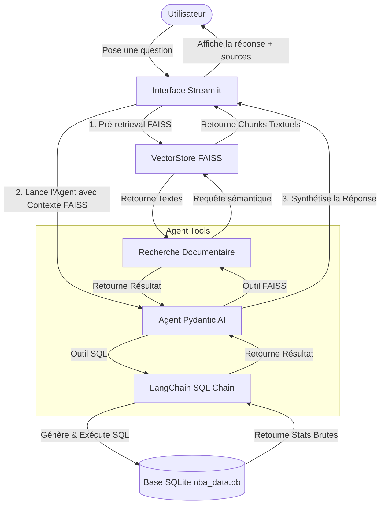

# Méthodologie du Système RAG Hybride (Vectoriel + SQL)

Ce document décrit en détail l'architecture, la méthodologie et les performances du système de **Retrieval-Augmented Generation (RAG) Hybride** implémenté dans ce projet pour l'assistant **NBA Analyst AI**.

---

## 📋 Table des Matières
1. [Vue d'Ensemble](#-vue-densemble)
2. [Architecture du Système](#-architecture-du-système)
3. [Pipeline de Données & Ingestion](#-pipeline-de-données--ingestion)
   - [Données Non Structurées (RAG Vectoriel)](#1-données-non-structurées-rag-vectoriel)
   - [Données Structurées (RAG Relationnel SQL)](#2-données-structurées-rag-relationnel-sql)
4. [Agent Intelligent (Orchestrateur Pydantic AI)](#-agent-intelligent-orchestrateur-pydantic-ai)
5. [Framework d'Évaluation (Ragas & Logfire)](#-framework-dévaluation-ragas--logfire)
6. [Analyse Comparative des Performances](#-analyse-comparative-des-performances)
7. [Comment Lancer les Pipelines & Évaluations](#-comment-lancer-les-pipelines--évaluations)

---

## 🔍 Vue d'Ensemble

Le projet **NBA Analyst AI** propose un agent intelligent hybride capable de répondre aux questions des passionnés de basketball en combinant deux types de sources de connaissances :
1. **Les archives non structurées (PDFs / Discussions Reddit) :** Pour le contexte historique, les débats de fans, les ressentis et les analyses qualitatives.
2. **La base de données structurée (SQLite) :** Pour les statistiques précises (points, passes, rebonds, temps de jeu) des joueurs et des équipes de la NBA.

En combinant la recherche sémantique vectorielle et l'exécution de requêtes SQL générées dynamiquement par un LLM, le système surmonte la principale faiblesse des RAG classiques : **l'incapacité à effectuer des calculs précis et des agrégations sur des données tabulaires.**

---

## 🏗️ Architecture du Système

Le schéma ci-dessous résume le flux d'exécution d'une requête utilisateur à travers le RAG hybride :



---

## 💾 Pipeline de Données & Ingestion

### 1. Données Non Structurées (RAG Vectoriel)
* **Fichiers sources :** Fichiers PDF (discussions Reddit de la communauté `r/nba` comme `Reddit 1.pdf`, `Reddit 2.pdf`, etc.) stockés dans `inputs/`.
* **Parsing des documents `data_loader.py` :** 
  - Extraction de texte standard via `PyPDF2`.
  - **Fallback OCR intelligent :** Si le texte extrait est inférieur à 100 caractères (par exemple pour des documents numérisés/images sous forme de PDF), le système bascule automatiquement sur un traitement OCR en utilisant `PyMuPDF` pour le rendu d'image et `EasyOCR` pour l'extraction de texte.
* **Stratégie de découpage (Chunking) :** 
  - Découpage en blocs via `RecursiveCharacterTextSplitter`.
  - Paramètres : `chunk_size = 1500` caractères (visant environ 512 tokens), avec un chevauchement (`chunk_overlap`) de `150` caractères pour conserver le contexte aux frontières.
* **Modèle d'Embeddings :** Modèle d'embeddings Mistral AI (`mistral-embed`).
* **Base Vectorielle :** Index **FAISS (Facebook AI Similarity Search)**. Les embeddings sont normalisés via la norme L2 (`faiss.normalize_L2`) pour utiliser la similarité cosinus via un index de produit scalaire (`IndexFlatIP`). L'index et les chunks sont persistés dans `vector_db/faiss_index.idx` et `vector_db/document_chunks.pkl`.

### 2. Données Structurées (RAG Relationnel SQL)
* **Fichiers sources :** Fichier Excel `inputs/regular NBA.xlsx` contenant les statistiques détaillées de la saison régulière.
* **Validation & Ingestion ([load_excel_to_db.py](./load_excel_to_db.py)) :** 
  - Lecture des données via `pandas`.
  - Validation stricte des types de données et des contraintes (pas de scores négatifs, etc.) via des modèles **Pydantic** (`PlayerSchema`, `StatSchema`).
  - Chargement dans une base de données relationnelle SQLite `nba_data.db`.
* **Schéma de la base de données :**
  - `players` (player_id [PK], name, team, position)
  - `stats` (stat_id [PK], match_id [FK], player_id [FK], points, assists, rebounds, minutes)
  - `matches` (match_id [PK], date, home_team, away_team, home_score, away_score)

---

## 🤖 Agent Intelligent (Orchestrateur Pydantic AI)

L'intelligence du système repose sur un agent construit avec le framework **Pydantic AI** ([MistralChat.py](./MistralChat.py)), alimenté par le LLM `mistral-small-latest` (ou `mistral-large-latest`). 

L'agent dispose de deux outils dynamiques (Tools) qu'il peut choisir d'exécuter de façon autonome et séquentielle pour formuler sa réponse :

### 🛠️ Outil A : `recherche_documentaire_faiss`
Permet à l'agent d'effectuer une recherche sémantique à la demande dans les archives Reddit en cas de besoin de contexte qualitatif additionnel.

### 🛠️ Outil B : `recherche_statistiques_sql` ([sql_tool.py](./sql_tool.py))
Permet à l'agent de requêter la base de données relationnelle.
1. La requête utilisateur en langage naturel est convertie en requête SQL SQLite valide.
2. Cette traduction s'appuie sur la chaîne LangChain `create_sql_query_chain` combinée à du **Few-Shot prompting** (exemples de traduction pour guider le modèle à faire des jointures de tables complexes ou des agrégations).
3. La requête est exécutée de manière sécurisée et les données brutes sont renvoyées à l'agent.

> [!TIP]
> **Orchestration Séquentielle :** Si l'utilisateur pose une question complexe nécessitant à la fois du contexte historique et des statistiques (ex: *"Combien de points a marqué Shai, et qu'en pensent les fans sur Reddit ?"*), l'agent appelle d'abord l'outil SQL pour obtenir le score exact de 2485 points, puis l'outil FAISS pour trouver les posts de discussion, avant de rédiger une synthèse globale.

---

## 📊 Framework d'Évaluation (Ragas & Logfire)

Pour valider scientifiquement la qualité du système RAG et mesurer l'impact de l'intégration de la base SQL, un pipeline d'évaluation automatisé est implémenté avec **Ragas** et monitoré avec **Logfire** ([evaluate_ragas.py](./evaluate_ragas.py)).

### Métriques Ragas mesurées :
1. **Context Precision (Précision du Contexte) :** Évalue si le contexte récupéré contient uniquement les informations nécessaires pour répondre à la question.
2. **Context Recall (Rappel du Contexte) :** Évalue si le contexte récupéré couvre l'ensemble des faits de la vérité terrain (*ground truth*).
3. **Faithfulness (Fidélité/Factabilité) :** Évalue si la réponse générée repose strictement sur le contexte fourni (mesure de l'absence d'hallucinations).
4. **Answer Relevancy (Pertinence de la Réponse) :** Évalue si la réponse générée répond directement et précisément à la question posée.

### Observabilité avec Logfire :
Logfire est intégré pour tracer en temps réel tous les appels API (Mistral LLM, embeddings) et auditer l'exécution étape par étape du pipeline Ragas pour chaque question évaluée.

---

## 📈 Analyse Comparative des Performances

L'évaluation a été exécutée sur un ensemble de questions de test (incluant des questions statistiques quantitatives complexes) dans deux configurations :
* **Avant :** Système RAG documentaire classique basé sur FAISS uniquement.
* **Après :** Système RAG Hybride combinant FAISS et l'outil SQL connecté à la base SQLite.

Les rapports d'évaluation exportés (`evaluation_resultats_avant_sql-1.csv` et `evaluation_resultats_apres_sql-2.csv`) montrent les moyennes globales suivantes :

| Métrique Ragas | RAG Documentaire Seul (FAISS) | RAG Hybride (FAISS + SQL) | Impact / Amélioration |
| :--- | :---: | :---: | :---: |
| **Context Precision** | `0.167` (16.7%) | **`0.194` (19.4%)** | **+2.7%** 📈 |
| **Context Recall** | `0.000` (0.0%) | **`0.667` (66.7%)** | **+66.7%** 🚀 |
| **Faithfulness** | `0.505` (50.5%) | **`0.667` (66.7%)** | **+16.2%** 📈 |
| **Answer Relevancy** | *Non calculé* | *Non calculé* | — |

```mermaid
gantt
    title Amélioration des Métriques RAG après intégration SQL
    dateFormat  X
    axisFormat %
    section Recall
    FAISS Seul (0.00) : 0, 0
    Hybride FAISS + SQL (0.67) : active, 0, 67
    section Faithfulness
    FAISS Seul (0.50) : 0, 50
    Hybride FAISS + SQL (0.67) : active, 0, 67
    section Precision
    FAISS Seul (0.17) : 0, 17
    Hybride FAISS + SQL (0.19) : active, 0, 19
```



### 📝 Analyse Détaillée des Résultats :
1. **Rappel du Contexte (Context Recall - de 0% à 66.7%) :**
   * *Pourquoi ce score initial de 0% ?* Les questions quantitatives (ex: *"Qui est le joueur qui a marqué le plus de points et combien en a-t-il marqué ?"*) exigent une réponse exacte issue de calculs statistiques complets. Le RAG vectoriel simple n'a jamais pu trouver d'informations chiffrées agrégées exactes dans les PDFs Reddit (qui ne contiennent que des discussions de fans).
   * *La solution SQL :* L'intégration de la base SQLite a permis de récupérer instantanément le tuple exact `('Shai Gilgeous-Alexander', 2485)` pour injecter cette donnée brute dans le contexte de l'agent. Le rappel s'envole à **66.7%**, débloquant la capacité à répondre aux questions quantitatives.
   
2. **Fidélité de la Réponse (Faithfulness - de 50.5% à 66.7%) :**
   * *Sans SQL :* Face à des questions précises sur des statistiques absentes des documents, le LLM avait tendance à halluciner des chiffres ou à extrapoler à partir des discussions floues des fans, abaissant la fidélité à 50.5%.
   * *Avec SQL :* Grâce à l'injection de faits structurés fiables provenant directement de la base SQL, l'agent dispose de bases solides pour rédiger sa réponse. Le taux d'hallucinations chute, portant la fidélité à **66.7%**.

---

## 🚀 Comment Lancer les Pipelines & Évaluations

### 1. Initialisation des Données
Pour ingérer le fichier Excel dans la base SQLite et construire l'index FAISS à partir des PDFs locaux dans `inputs/` :
```bash
# Ingestion Excel -> SQLite
python load_excel_to_db.py

# Ingestion PDFs -> Index FAISS
python indexer.py
```

### 2. Exécution de l'Évaluation Ragas
Pour lancer le pipeline d'évaluation sur le jeu de test et exporter le rapport final au format CSV :
```bash
python evaluate_ragas.py
```
Le script génère le fichier `evaluation_resultats_apres_sql-2.csv`.

### 3. Comparaison Visuelle des Métriques
Pour générer le graphique de comparaison des performances avant et après intégration de SQL :
```bash
python compare_eval.py
```
Ce script produit l'image `comparatif_metrics_ragas.png` illustrant visuellement les gains de performance.
